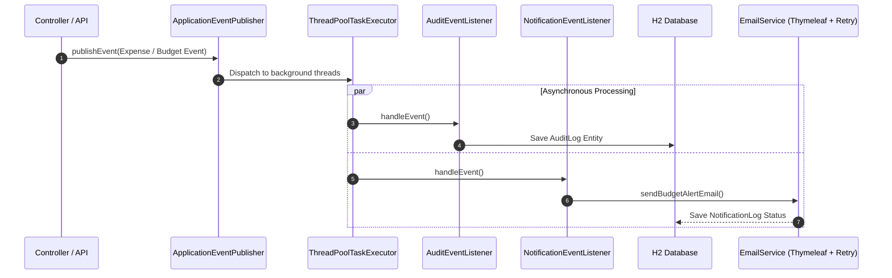

# ⚡ Event-Driven Audit & Notification Service

An enterprise-grade, asynchronous backend service for decoupled **audit logging**, **dynamic HTML email notifications**, and **automated database maintenance** — built on Spring Boot 3, Java 17, Spring Events, and Spring Retry.

---

## 📐 Architecture



**Compact flow:**

```
Trigger Event → Publisher → Task Executor
                                 │
                ┌────────────────┴────────────────┐
                ▼                                  ▼
       AuditEventListener              NotificationEventListener
                │                                  │
                ▼                                  ▼
       Save Audit Record              Send HTML Mail (with Retry)
```

---

## 🛠️ Tech Stack

| Layer | Technology |
|---|---|
| Core Framework | Spring Boot 3.2.2 |
| Language | Java 17 |
| Async Engine | Spring `@Async` + custom `ThreadPoolTaskExecutor` |
| Events | `ApplicationEventPublisher`, `@EventListener` |
| Fault Tolerance | Spring Retry (`@Retryable`, `@Recover`) |
| Scheduling | Spring Task Execution (`@Scheduled` cron jobs) |
| Notifications | `JavaMailSender` + Thymeleaf HTML templates |
| Database / ORM | H2 (in-memory) + Spring Data JPA |
| API Docs | SpringDoc OpenAPI 3 / Swagger UI |
| Dev Utilities | Lombok, Spring Boot Validation |

---

## 📋 Core Features

- **Non-blocking audit dispatch** — decouples `ExpenseCreatedEvent` / `BudgetExceededEvent` from thread-blocking DB writes via a dedicated task pool.
- **HTML email engine** — renders contextual budget-alert emails using Thymeleaf templates.
- **Fault-tolerant retries** — exponential backoff (up to 3 attempts) on SMTP failures, with `@Recover` fallback logging on exhaustion.
- **Automated cron jobs:**
    - **Weekly digest** — aggregates active audit logs.
    - **Monthly purge** — deletes logs older than 30 days.
- **Interactive API docs** — full OpenAPI/Swagger coverage for querying and triggering events.

---

## 🚀 Getting Started

### Prerequisites
- JDK 17+
- Maven 3.8+

### Setup

```bash
# 1. Clone
git clone https://github.com/Aryan7755/audit-notification-api.git
cd audit-notification-api

# 2. (Optional) Configure SMTP credentials
export MAIL_USERNAME="your_mailtrap_username"
export MAIL_PASSWORD="your_mailtrap_password"

# 3. Run
./mvnw spring-boot:run
```

The application starts on **port `8081`**.

---

## 🔗 Endpoints & Docs

| Resource | URL |
|---|---|
| Swagger UI | http://localhost:8081/swagger-ui/index.html |
| H2 Console | http://localhost:8081/h2-console |
| JDBC URL | `jdbc:h2:mem:auditdb` |
| Username | `sa` |
| Password | *(empty)* |

### API Reference

| Method | Endpoint | Description |
|---|---|---|
| `POST` | `/api/audits/trigger/expense` | Trigger an expense-creation event asynchronously |
| `POST` | `/api/audits/trigger/budget` | Trigger a budget-warning event asynchronously |
| `GET` | `/api/audits` | Fetch all persisted audit logs |
| `GET` | `/api/audits/user?email={email}` | Filter audit logs by user email |
| `GET` | `/api/notifications` | Retrieve email notification delivery logs |

---

## 📝 Summary

**What it does:** decouples audit logging & notifications from request threads using Spring Events + async processing.

**Why it's reliable:** retry logic with exponential backoff ensures email failures don't lose data.

**How it stays clean:** scheduled cron jobs handle digesting and purging automatically.